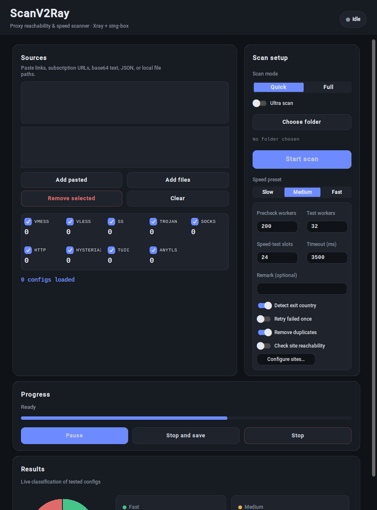

<div align="center">

# 🛰️ ScanV2Ray

### A fast, modern Windows scanner that finds the proxy configs that actually work.

Paste thousands of `vmess` / `vless` / `trojan` / `ss` / `socks` / `http` / `hysteria2` / `tuic` / `anytls` / `wireguard` links,
and ScanV2Ray really launches them, measures real connectivity and speed, ranks them, and exports the winners.



</div>

---

## Table of contents

- [What it is](#what-it-is)
- [Why it's different](#why-its-different)
- [Supported protocols](#supported-protocols)
- [How a scan works](#how-a-scan-works-the-pipeline)
- [How configs are scored](#how-configs-are-scored)
- [Every feature, explained](#every-feature-explained)
- [The interface](#the-interface)
- [Output files](#output-files)
- [Install & run](#install--run)
- [Build the .exe yourself](#build-the-exe-yourself)
- [Recommended settings](#recommended-settings)
- [How it's built (architecture)](#how-its-built-architecture)
- [FAQ & troubleshooting](#faq--troubleshooting)
- [License](#license)

---

## What it is

ScanV2Ray is a **Windows desktop app** that takes a big pile of proxy share‑links and tells you which ones are alive, how fast they are, and where they exit — by actually running each one through the bundled **Xray** and **sing‑box** cores, not by guessing from the link text.

You give it links from almost any source (pasted text, a subscription URL, a base64 blob, a JSON dump, or local files). It normalizes them, spins up each proxy locally, drives real HTTP requests through it, scores the result, and classifies every config as **fast / medium / slow / dead** — with a live dashboard updating as it goes. When it's done you copy or export the working ones, already renamed and (optionally) tagged with their exit country.

It's designed for large batches: tens of thousands of configs in one run, without freezing the UI.

---

## Why it's different

- **It tests for real.** Every surviving config launches an actual core process as a local HTTP proxy on `127.0.0.1`, and real requests are pushed through it. No "looks valid, probably works."
- **Dual engine.** Xray handles vmess/vless/trojan/ss/socks/http; sing‑box handles hysteria/hysteria2/tuic/anytls/wireguard. The right engine is picked per‑config automatically.
- **Streaming, bounded, and interruptible.** Real‑testing begins the moment the first config passes precheck (no waiting for all 50k to be checked first), a fixed rolling pool caps how many cores run at once, and **Stop** instantly kills every running core.
- **Built for scale.** A coalesced UI refresh loop keeps the app smooth even while scanning tens of thousands of links.
- **Honest output.** Configs are renamed, numbered, tagged with their real exit country, and exported in JSON / CSV / grouped TXT.

---

## Supported protocols

| Protocol | Engine | Notes |
|---|---|---|
| `vmess` | Xray | full (ws/grpc/h2/quic/kcp, tls/reality) |
| `vless` | Xray | full, incl. XTLS `flow` + REALITY |
| `trojan` | Xray | full |
| `ss` (Shadowsocks) | Xray | SIP002; `plugin=` links are accepted (plugin ignored) |
| `socks` | Xray | with or without user:pass |
| `http` | Xray | with or without user:pass |
| `hysteria` | sing‑box | v1 |
| `hysteria2` / `hy2` | sing‑box | incl. Salamander obfs |
| `tuic` | sing‑box | v5 |
| `anytls` | sing‑box | |
| `wireguard` | sing‑box | best‑effort from `wireguard://` links |

> Both `xray.exe` and `sing-box.exe` ship inside the app under `Core/`, so there's nothing else to download.

---

## How a scan works (the pipeline)

Every config flows through a single **streaming pipeline**. There is no hard barrier between stages — as soon as a config clears one stage it moves to the next, while the rest are still being processed.

```
  50,000 links
       │
       ▼
 ┌─────────────────────┐   Phase 1  ·  cheap, highly parallel
 │  1. Precheck (TCP)   │   Parse + validate the link, then a raw TCP
 │                      │   connect to host:port. UDP/QUIC protocols
 │  parse → validate →  │   (hysteria/tuic/wireguard) skip this and go
 │  socket connect      │   straight to the real test.
 └──────────┬───────────┘
            │  reachable ones stream into ▼
 ┌─────────────────────┐   Phase 2  ·  bounded rolling pool of cores
 │  2. Validate + Test  │   • build the engine config JSON
 │                      │   • `xray -test` / `sing-box check`  (config valid?)
 │  build → check →     │   • launch the core as a local HTTP proxy
 │  launch → measure    │   • drive real requests through 127.0.0.1
 └──────────┬───────────┘   • measure latency, speed, stability, exit IP
            │
            ▼
 ┌─────────────────────┐
 │  3. Score & classify │   fast / medium / slow / dead
 └──────────┬───────────┘
            ▼
   rename + tag country → live dashboard → export
```

**What "measure" actually does:** through the local proxy it hits `generate_204` endpoints (gstatic / google) and the Cloudflare `cdn-cgi/trace` page to time the first response and confirm connectivity, then downloads a chunk from `speed.cloudflare.com` to measure throughput. Optionally it also checks whether specific sites (YouTube, Instagram, Telegram, ChatGPT, …) open through the proxy.

**Concurrency is a rolling pool.** At most *Test workers* cores run at the same time; when one config finishes and its core exits, the next config starts. This is what keeps CPU usage sane while still moving fast.

---

## How configs are scored

Each tested config gets a **0–100 score** from four weighted signals, then a class:

| Signal | Weight | How it's measured |
|---|---:|---|
| **Download speed** | 35% | full marks at ≥ 150 kbps through the proxy |
| **Latency** | 30% | first‑response time; full marks near 0 ms, none by ~1500 ms |
| **Stability** | 25% | share of probe requests that succeeded |
| **Success** | 10% | 100 if ≥ 85% probes ok, 60 if ≥ 60%, else 20 |

```
score = speed·0.35 + latency·0.30 + stability·0.25 + success·0.10
```

**Classification:** `fast ≥ 60` · `medium ≥ 40` · `slow < 40`. A config that can't move data at all (very low success **and** ~0 kbps) is marked **dead** immediately.

> The thresholds are deliberately forgiving so real‑world proxies land in fast/medium instead of all collapsing into slow. Use **Full** mode for the most accurate speed ranking (it downloads more data per test than **Quick**).

---

## Every feature, explained

### Importing
- **Anything goes in:** raw share‑links, a **subscription URL** (fetched over HTTP), a **base64** blob, a **JSON** dump, or **local files** — pasted or added from disk.
- **Protocol filter:** tick which protocols to include; a big live counter shows how many of each you've loaded.
- **Deduplicate** *(toggle, on by default):* drops duplicate configs by identity (proto + host + port + credentials + transport + security), keeping the first — so re‑pasting the same subscription doesn't scan everything twice.

### Testing controls
- **Scan mode — Quick / Full:** Quick is a lighter, faster probe for triage; Full downloads more per test for a more reliable speed ranking.
- **Ultra scan:** pushes the real‑test pool wider for maximum throughput on strong machines.
- **Speed presets — Slow / Medium / Fast:** one click fills the four numeric controls below; you can still hand‑edit them.
  - **Precheck workers** – parallel TCP prechecks (cheap).
  - **Test workers** – max cores running at once (the main CPU/network dial).
  - **Speed‑test slots** – max simultaneous speed downloads.
  - **Timeout (ms)** – per‑request budget.

### Results & quality
- **Exit country & IP** *(toggle):* after connecting, ScanV2Ray reads the Cloudflare trace through the proxy to learn the **exit IP and country**, and puts a 🇩🇪‑style flag in front of each config's name — or a 🌐 globe when the country can't be determined.
- **Rename + numbering:** set an optional **Remark** and every working config is renamed to `Remark-1`, `Remark-2`, … *inside the link itself* (the `#fragment`), so your client shows the new names — not just a column in a file.
- **Retry failed once** *(toggle):* gives a config that fails the real test a second chance before it's marked dead.
- **Site reachability** *(toggle):* choose target sites (YouTube / Instagram / Telegram / ChatGPT / Google) and add your own; the report shows which sites each config can open. In **strict** mode a config only passes if it reaches the selected sites. (A site returning `403` still counts as reachable — it means the proxy tunneled to it.)

### Running a big scan
- **Live dashboard:** a donut chart shows the fast/medium/slow/dead split with the running total in the middle, next to live counters — all updating during the scan.
- **Pause / Resume.**
- **Stop → Phase 2** *(during precheck):* stop prechecking the remaining links and jump straight to real‑testing whatever is already reachable — perfect when you loaded 50k IPs but don't want to wait for all of them.
- **Stop and save** *(during real‑testing):* stop now and keep everything completed so far.
- **Stop:** abort and discard.

### Exporting
- **Copy Fast / Medium / Slow / All** straight to the clipboard (already renamed).
- Full result set written to an output folder as JSON, CSV, and grouped TXT files.

---

## The interface

- **Sources** – paste box, loaded‑sources list, protocol filter with big live counts.
- **Scan setup** – mode, Ultra toggle, output folder, **Start scan**, speed preset, and the always‑visible advanced panel (worker counts, timeout, remark, and every feature toggle + **Configure sites…**).
- **Progress** – status, progress bar, and **Pause / Stop → Phase 2 (or Stop and save) / Stop**.
- **Results** – live donut + Fast/Medium/Slow/Dead tiles + **Copy** buttons.
- **Activity log** – a running, capped log of the scan (also written to `scan_log.txt`).

---

## Output files

When you pick an output folder, results are written into `Scan_Results/`:

| File | Contents |
|---|---|
| `scan_results.json` | every result with all fields (score, latency, speed, exit_ip, exit_country, sites_ok, …) |
| `scan_results.csv` | the same, as a spreadsheet‑safe CSV |
| `fast_verified.txt` | working **fast** configs (`link \| remark`) |
| `medium_verified.txt` | working **medium** configs |
| `slow_verified.txt` | working **slow** configs |
| `dead.txt` | failed configs, each with its failure reason |
| `scan_log.txt` | full run log |

---

## Install & run

**Easiest — grab the ready `.exe`:**
Download the latest **`ScanV2Ray-x.y.z.exe`** from the [Releases](../../releases) page and double‑click it. No Python needed.

**From source:**

```bash
# Windows · Python 3.12+
pip install -r requirements.txt
python Scan.py
```

Requirements: Windows, Python 3.12+, `customtkinter`. The `Core/xray/xray.exe` and `Core/sing_box/sing-box.exe` cores are already in the repo.

---

## Build the .exe yourself

Every git tag `vX.Y.Z` triggers a **GitHub Actions** workflow that builds `ScanV2Ray-X.Y.Z.exe` on Windows with PyInstaller and publishes it to Releases — and older releases are kept forever. To cut a release:

```bash
git tag -a v1.2.3 -m "ScanV2Ray 1.2.3"
git push origin v1.2.3
```

Locally on Windows:

```powershell
pip install pyinstaller customtkinter
pyinstaller --noconfirm ScanV2Ray.spec   # -> dist/ScanV2Ray.exe
```

---

## Recommended settings

- **Triage a huge list:** `Quick` mode, `Medium` or `Fast` preset. Reach for **Stop → Phase 2** if you don't need every IP prechecked.
- **Pick your daily configs:** `Full` mode, `Medium` preset — the most trustworthy speed ranking.
- **Weak machine / gentle scan:** `Slow` preset (fewer cores at once).
- **Concurrency** in this app means *how many cores run simultaneously* (Test workers). If your CPU or network struggles, lower it; if you have headroom, raise it (or turn on Ultra).

---

## How it's built (architecture)

```
Scan.py                     launcher
scanv2ray/
├─ ui.py        modern customtkinter dashboard + scan orchestration
├─ engine.py    the streaming pipeline (precheck → bounded test pool) + dedupe
├─ scanner.py   dual-engine core control: build/validate/launch/measure/score
├─ parser.py    share-link parsing → one normalized config dict
├─ configs.py   build Xray / sing-box JSON + pick the engine per protocol
└─ naming.py    rename links (#fragment) with country flag + numbering
Core/
├─ xray/xray.exe
└─ sing_box/sing-box.exe
```

The pipeline (`engine.py`) is fully decoupled from the UI — the GUI just feeds it links and receives progress callbacks — so the same engine can later drive a headless / server / bot front‑end.

---

## FAQ & troubleshooting

**Windows Defender / SmartScreen warns about the .exe.**
Expected. It's an unsigned app that launches `xray.exe`/`sing-box.exe` (network tools antivirus is naturally suspicious of). Click **More info → Run anyway**. It is not malware.

**It's a scanner, not a VPN client.**
ScanV2Ray finds and ranks working configs; to actually browse through one, import a config it exported into a real client (v2rayN, Nekoray, …).

**Nothing passes with site‑check strict mode.**
Fixed — a site that responds with any HTTP status (even `403`) now counts as reachable, because the proxy still tunneled to it. Only real connection failures/timeouts fail a site.

**Speed test endpoints.**
Connectivity/speed are measured against Google/Cloudflare endpoints. In heavily‑throttled networks these can skew results; prefer Full mode and re‑scan.

---

## License

Personal use.
